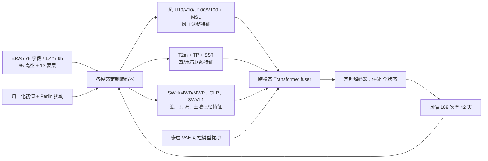

# FengWu-W2S：六小时连续递推的天气—次季节海陆气联合集合

> Fenghua Ling、Kang Chen、Jiye Wu、Tao Han、Jing-Jia Luo、Wanli Ouyang、Lei Bai，*FengWu-W2S: A deep learning model for seamless weather-to-subseasonal forecast of global atmosphere*，[arXiv:2411.10191v2，2024-11-20](https://arxiv.org/abs/2411.10191)；[全文 PDF，含方法、图 1–5、补图 S1–S3、表 S1](https://arxiv.org/pdf/2411.10191v2)。2026-09-24 按 v2 原文和 PDF 页面逐图核验。与[中期 FengWu](../medium-range/02-fengwu.md)属于同系列，但字段、1.4° 网格、海陆气交互、两类集合扰动、42 天目标均不同；应作独立 S2S 工作，不将两篇的成绩混为一套。

## 一、核心问题、时效与不能夸大的“无缝”

作者追求不在第 10–15 天切换另一个周平均模型，而让同一个网络每 **6 小时**推一步，直接递推 **42 天=168 步**。这样从日尺度中期到 3–6 周的天气状态具有同一预报轨迹，但“无缝”指计算链连续，**不等于 42 天每个格点或极端事件都有正技巧**。论文通过引入 SST、波浪、浅层土壤水，以及表面变量分组交互和集合扰动来减慢长滚动误差。这里的“海陆气耦合”是网络变量/特征交互，不是显式求解海洋、陆面能量与质量守恒方程；论文没有完成跨通量的守恒闭合检验。[正文 Results、Methods](https://arxiv.org/pdf/2411.10191v2)

最后还把模型推到约 **3 个月/360 步**观察误差增长和月平均 T2m 的残留信号。此项属于外推/诊断，主论文的已系统验证业务目标仍是 **0–42 天**，不应写成已经充分验证的季节预报系统。作者自己列明三项缺口：**不能模拟 SSW、缺海冰信号、网格仅约 1.4°**。[正文 Conclusions、图 5](https://arxiv.org/pdf/2411.10191v2)

## 二、数据年份、变量和预处理

| 数据层 | 具体资料 | 对复现和成绩的意义 |
| --- | --- | --- |
| 训练/验证切分 | ERA5 资料到统一 **128×256、约 1.4°** 全球网格；训练 **1979-01-01 至 2016-12-31**，主技巧测试 **2017–2021**。原 ERA5 小时资料取 **6 小时**间隔；降水是**前 6 小时累计量**，并非某一时刻瞬时雨率。 | 论文未精确公开从原始 ERA5 到 128×256 的空间插值核、每字段归一化统计、海洋/陆地缺测掩码和 0/360° 波向编码；不能凭前代 FengWu 版本代填。 |
| 13 层高空 | `Z,T,U,V,Q` 各 13 气压层：50、100、150、200、250、300、400、500、600、700、850、925、1000 hPa，合计 **65 字段**。 | 压层最顶只到 **50 hPa**，与缺 SSW 能力的自述相呼应；没有 2/5/10 hPa 的显式平流层上部状态。 |
| 13 单层/表层字段 | `T2m,TP,SST,OLR,SWVL1(0–7 cm),U10,V10,U100,V100,MSL,SWH,MWD,MWP`，加上高空总计 **78 字段**。 | 土壤只有浅层 `SWVL1`，海洋主要 SST + 波浪而没有深海温盐、海冰；不能宣称全海陆系统的长期记忆都显式表示。字段清单与分组据 PDF **表 S1**，而不是照摘要推测。 |
| 异常气候态 | 2002–2016 **15 年**的观测/ERA5 气候态；另用模型 **2002–2022、30 成员**回报构造模型气候态，2017–2022 还做 **100 成员**扩展版。 `FengWu-W2So` 用**观测气候态**算异常，`W2Sm` 用**模型回报气候态**。 | 模型气候态的 2002–2016 段与训练年代重叠，故“拥有 21 年回报”不等于“21 年独立预报验证”。独立主评分段为 **2017–2021**，先分清气候态口径再比较 ACC/TCC。 |

数据字段与年份来自[Methods/Data、表 S1](https://arxiv.org/pdf/2411.10191v2)。论文说资料为 1.4° 的 ERA5 派生产品，但没有提供下载即得的全量训练张量、逐点质量控制和标准化脚本；这是真实复现缺口。数据声明中列 ERA5 CDS 与 ECMWF S2S 比较资料来源，也不足以重建每次模型运行时的 exact grid/QC。[Data and materials availability](https://arxiv.org/pdf/2411.10191v2)

## 三、结构图重绘：海陆气特征如何交换

模型继承 FengWu 的多模态编码器—Transformer fuser—多模态解码器：不同变量先作模态定制编码，之后跨模态融合，再各自解码为下一 6 小时场。W2S 的变化在于**表层变量不再一股脑合并**：风和气压共享一组特征以建模风压调整；温度、降水和 SST 共享另一组以学习热/水汽联系；海浪 SWH/MWD/MWP 与风相互作用；OLR 与浅层土壤水作为慢变化或对流可预报性信息，通过 fuser 同上层环流交互。补图 S1B 展示的是**特征通路示意**，没有证据表明网络显式计算物理通量或强制守恒。[Methods、补图 S1A–B](https://arxiv.org/pdf/2411.10191v2)

图按原文[补图 S1](https://arxiv.org/pdf/2411.10191v2)和方法段**原创重绘**，表示信息流而非精确张量计算图。论文公开两阶段硬件/优化参数，但在此稿没有系统列出每个 encoder 的层数、Transformer 头数、参数总量、VAE 各层维度和所有变量的标准化因子；不得把前代 0.25° FengWu 参数量移植到 W2S。[Methods](https://arxiv.org/pdf/2411.10191v2)

## 四、集合：两类扰动与模型为何还要微调

**初值扰动**在归一化后的分析初值上叠加 Perlin noise，模拟初始条件不确定性。作者试过 ECMWF EDA 扰动，认为归一化后幅度过小；也试过扩散式同化扰动，但 spread 仍小且算力明显增加。这是其所给设计理由，并未提供可外推到所有初值资料的统一定量最优证明。[Methods/Ensemble forecast strategy](https://arxiv.org/pdf/2411.10191v2)

**可控模型扰动**在微调阶段引入多层 VAE：不同空间尺度/变量的 encoder 潜特征使用各自随机扰动，再由解码侧还原，从而模拟模型不确定性。作者报告扰动 T2m 与 SST 分支会损害技巧，于是有**人工开关**关闭指定变量的扰动；论文明确说开关以后才考虑自动学习。这个“模型扰动”与普通权重随机初始化或推理时对所有参数统一加噪不同；不能笼统写成“模型参数 ensemble”而漏掉多层 VAE、尺度适配和变量开关。初值扰动可改善第 2–3 周，却在最初一周有时伤技巧、第 4 周后减效；两类扰动合并缓解这些缺点。[Methods、图 5B、补图 S1C](https://arxiv.org/pdf/2411.10191v2)

| 阶段 | 原文可核参数 | 微调/未公开部分 |
| --- | --- | --- |
| 第一阶段 | PyTorch，**8×A100**，总 batch **32**，**50 epochs**；使用沿前代 FengWu 的 probability loss；AdamW `β1=0.9, β2=0.9`、初始 LR `5×10^-4`（方法段对整体优化的描述）。 | 本文说“builds on FengWu”与“inherits architecture”，但没清楚说明第一阶段是否加载前代 FengWu 的现成权重；不得默认是权重迁移。损失精确多模态系数、weight decay、LR 退火、warmup 和 wall time 均未在此文明确列出。 |
| 第二阶段 | 从**第一阶段权重继续**，加入多层 VAE 和跨层 KL 惩罚，**再 40 epochs**；总损失为前述 probability loss 加 `λ × Σ KL_layer`，`λ=10^-4`。 | 这是本文明确的**模型微调**，不是对第 1 阶段网络完全重新从头训练。原文没有列每层 KL 的单独权重、VAE latent 大小、扰动幅度的最终开关表或是否对某些旧层冻结。 |
| 长滚动/回报 | 推理 6h 一步、42 天共 168 次；2002–2022 回报 30 成员，2017–2022 扩到 100 成员。 | 原文没有明示训练时完整展开 168 步反向传播；不可把推理步长和训练 BPTT 长度混同。生成 **300 TB 以上**历史回报，作者称其成本远大于训练。 |

训练参数和损失据[Methods/Training details](https://arxiv.org/pdf/2411.10191v2)核对；PDF 公式的文本抽取有乱码，笔记只保留可由原版页面辨识的结构，不伪造精确项名。

## 五、验证协议、图表性能与反例

论文主要比较 2017–2021 的周平均 `T2m, TP, Z500, OLR` 异常技巧（图 1），全球/局地双周 TCC、90 分位极端 BSS、三分类 RPSS（图 2），以及 MJO/NAO/遥相关指数（图 3–4）。**TCC/ACC 为确定性异常相关**，BSS 和 RPSS 是概率技巧；参考气候态可取观测或模型，分母和异常场定义随之改变。图 2 降水评价在两周累计 `<1 mm` 的近无雨区施加 dry-mask，不能与未经遮罩的全域评分混排。[Methods/Evaluation metrics、图 1–4](https://arxiv.org/pdf/2411.10191v2)

| 图/时间范围 | 作者得到的积极结果 | 同图或原文必须保留的反例 |
| --- | --- | --- |
| 图 1，2017–2021、周 3–6 | 用观测气候态 `W2So` 或模型气候态 `W2Sm`，T2m/Z500 的多个周段相关高于 ECMWF 和 FuXi-S2S，TP 与 OLR 也有优势。 | **W2So 普遍高于 W2Sm**，特别非热带/较长 lead；不能把两种异常计算方式当作两个独立训练好的模型。PDF 图注把 C 误写 T2m、D 误写 Z500，但实际面板标题为 **C=Z500、D=OLR**；本笔记按面板与正文校正。 |
| 图 2、S2，周 3–4 与 5–6 的空间图 | 第 3–4 周 T2m 异常相位多地可辨；赤道海洋/热带强降水区有较强信号，部分极端降水和干湿分类胜气候态。 | 第 **5–6 周**的东亚海岸、北美大西洋沿岸温度相关可为负；陆地 T2m 三分类 RPSS **通常低于气候态**，东赤道太平洋极热 BSS 较差；少雨干旱区降水表现也差。不能用图 1 的全球均值掩盖区域负技巧。 |
| 图 3，MJO | 以 RMM 指数 TCC>0.5 定义，W2S **约 37 天**，ECMWF **约 32 天**；30 天 lead 的 OLR 东传仍可辨，2019 一个强个例约 40 天。 | 复合 MJO 在 3 周后幅度偏弱；单个 2019 事件不是 40 天普适技巧。且与 AIFS-SUBS 的“OLR 单分量 33 vs 25 天”**指标/版本不同，不能直接排榜**。 |
| 图 4，NAO/遥相关 | `W2Sm` NAO 日指数 ACC>0.5 至 **20 天**，观测气候态的 `W2So` 至 **28 天**，第 4–6 周的周平均 NAO 比 ECMWF 有利；PJ 型的可用技巧较其他遥相关持久，可到约 4–5 周。 | PNA、EA、WP、EU 等大多 1–2 周有技巧，**4–6 周很弱**；冬季两个 NAO 个例前 10 天最清楚，不能当全部周段普适证明。 |
| 图 5 与 S3，误差增长/消融 | 新增海陆气字段的 FengWu-AOL、显式交互模块、联合初值+模型扰动各自改善长滚动；42 天后误差增长较慢，三个月月平均 T2m 尚有局部相关。 | 误差仍继续增长；初值扰动一周内可能退步、四周后效益变弱；三个月测试没有证明完整季节业务能力。作者报告未能模拟 SSW、无海冰。S3 为中期集合对照，不能外推概率校准至 42 天。 |

这些内容来自[PDF 主图 1–5、补图 S1–S3](https://arxiv.org/pdf/2411.10191v2)；表为人工读图与正文交叉检查后的**定性/明确整数**重建，没有从条形高度反推小数级假数据。图 1 尤其说明技巧对观测 vs 模型气候态敏感：若有系统偏差，用模型气候态不一定自动变得更可靠。原文坦言为此制作 >300 TB 回报，成本超过网络训练，且对于 AI 模型“自身气候态为何更差”的原因仍不明确。[结论](https://arxiv.org/pdf/2411.10191v2)

## 六、如何复现和进一步检验

最低要求是重建 **78 字段/13 层/1.4°/6h** 的原始 ERA5 流程，降水用 6h 累积、统一 2017–2021 测试、严格区分 2002–2016 观测气候态和 2002–2022 模型回报气候态；训练阶段应记录 50+40 epoch、A100/batch/AdamW、VAE 层/开关和扰动幅度，不能把后者视为“未微调”。还应审查 2002–2016 回报气候态与训练期重叠的影响、同一初值/真值的 ECMWF 和 FuXi-S2S 公平比较、极端降水 dry-mask、各海陆字段的缺测与变量标准化。下一轮独立评估需要更长的前向年份、区域负技巧分层、概率可靠性/spread-skill、SSW 与海冰耦合，以及是否满足通量守恒；以全球平均 TCC 或一个 MJO 个例宣布“已达到季节预报”并不充分。

[返回首页](../../README.md)
