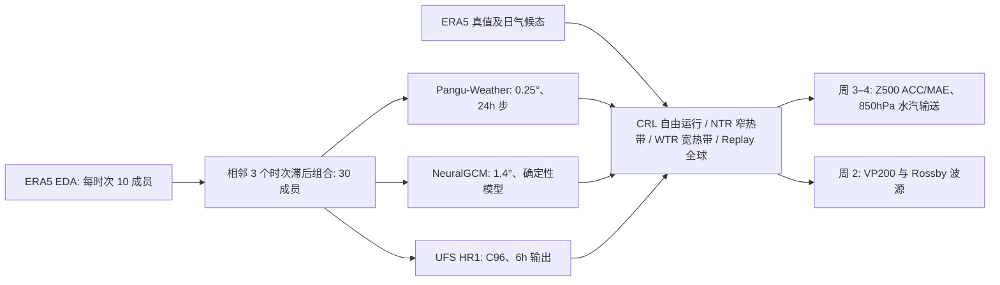

# 用热带松弛实验诊断 AI 天气模型的第 3–4 周降水事件：Pangu-Weather、NeuralGCM 与 UFS

> Siyu Li、Juliana Dias、Benjamin Moore、Julian Quinting，*Impacts of tropical forecast errors on two extreme precipitation events: insights from relaxation experiments using machine-learning weather prediction models*，*Weather and Climate Dynamics* 7, 787–803，2026-05-19 正式发表，DOI [10.5194/wcd-7-787-2026](https://doi.org/10.5194/wcd-7-787-2026)。2026-01-14 开始公开讨论，2026-04-13 接受。阅读日期：2026-09-24。**证据级别：期刊正式开放全文及原文表 1/2；本笔记不是对原图的转载。**

## 1. 研究问题与边界

论文问的不是“再训练一个更强的中期大模型”，而是：对两个西北美强降水事件，若把热带的预报误差人为压到 ERA5，远端第 3–4 周的北太平洋/北美环流会否随之改善？如果 Pangu-Weather 和 NeuralGCM 也有这种响应，那么它们至少在所选个例上保留了热带—副热带—中纬度传播链的一部分。UFS 物理数值系统作方法对照。主评估量是 **500 hPa 位势高度距平的区域 ACC/MAE**和 **850 hPa 水汽通量**，**不是降水量预报本身的逐格点评分**；作者明确说所用 ML 模型不直接给出可比降水输出。[原文 §1–3](https://wcd.copernicus.org/articles/7/787/2026/)

两个事件分别为 2022 年 12 月末—2023 年 1 月中旬，以及 2023 年 2 月中旬—3 月初。前者从 2022-12-15 起报，验证平均区间是 2022-12-30 至 2023-01-13；后者从 2023-02-02 起报，验证平均区间是 2023-02-17 至 2023-03-03。都是单次初始日附近的**个例研究**，即使有 30 个成员，也不能推出多年 S2S 普遍排行榜。[§2.1、§2.3](https://wcd.copernicus.org/articles/7/787/2026/)

示意图据论文 §2 重绘；这里的「松弛」是**积分时替换/拉近状态**，不是反向传播微调权重。热带信息由 ERA5 真值注入，因此 NTR/WTR 是可预测性诊断和近似“完美热带”反事实，**不能充作未来业务预报的可用性能**。[§2.4](https://wcd.copernicus.org/articles/7/787/2026/)

## 2. 数据、预处理与比较公平性

| 项目 | 原文设置 | 阅读时的意义 |
|---|---|---|
| 起报资料 | ERA5 的 10 成员 ensemble of data assimilations (EDA)；原始规则经纬网 0.5°×0.5°。每个个例组合起报附近三个时次，各 10 成员，共 **30 个 time-lagged 成员** | 不是 30 套独立训练的网络，也不是仅用单个确定性 ERA5 分析复制 30 次；滞后时次提供额外离散度。原文举首例的 2022-12-14 12 UTC、12-15 00 UTC、12-15 12 UTC。[§2.1](https://wcd.copernicus.org/articles/7/787/2026/) |
| 对齐 | EDA 与 ERA5 验证场均以**双线性插值**映射到各模型原生网格；ERA5 验证原始分辨率 0.25° | 三套模型并不在同一分辨率上运行；若复验要记录先插值再松弛/验证的位置。[§2.1、§2.3](https://wcd.copernicus.org/articles/7/787/2026/) |
| 气候态 | 1990–2019 ERA5 日气候态，来自 WeatherBench2；按年内日与时次做中心权重线性衰减的滑窗平滑 | 高度距平/ACC 的基线依赖这个气候态。平滑减少抽样噪声但也稍减年循环振幅；不能换成未平滑气候态后直接对比。[§2.3](https://wcd.copernicus.org/articles/7/787/2026/) |
| 预测时效 | 三模型各积分 **30 天**；主要把第 3–4 周两周内逐日预报做平均 | 图 2/5 的成绩是两周平均环流，不是每日单点 ACC；图 3/6 的 RWS 是更早的第 2 周。[§2.3、§3](https://wcd.copernicus.org/articles/7/787/2026/) |
| 区域/指标 | 30–60°N、170°E–90°W；纬度加权、中心化的 Z500 距平 ACC 与 MAE | ACC 看空间型态，MAE 看高度绝对误差；必须同时报告，避免只用一个较有利的指标。[§3](https://wcd.copernicus.org/articles/7/787/2026/) |

850 hPa 水汽通量按比湿与水平风向量相乘，文中看其模长；它只刻画动力水汽输送，**不含凝结、微物理、地形降水效率**。图 1 的 ERA5 累积降水用于描述事件真值，不表示三套模型均对降水做了同口径直接评分。[§2.4.1、图 1](https://wcd.copernicus.org/articles/7/787/2026/)

### 模型结构与本文使用的权重

- **Pangu-Weather**：纯数据驱动 3D 全球网络；本文复用已训练权重，原训练使用 1979–2017 的 39 年 ERA5、0.25° 网格、13 个气压层。原模型分别训练 1/3/6/24 小时版本；**本实验仅选择 24 小时版本自回归到 30 天**，并从 EDA 成员形成集合。模型没有 SST 与海冰预报/耦合，故长积分无法借此提供海洋慢变量反馈。[§2.2.3](https://wcd.copernicus.org/articles/7/787/2026/)
- **NeuralGCM**：微分动力核求解大尺度方程，神经列物理模块参数化未解析过程；本文使用 **1.4°、37 sigma 层、确定性、自回归**配置。成员离散只来自 EDA 初值，而非本文重训的随机权重。主实验每天给定 ERA5 的 SST 与海冰浓度，这把未来海表真值输入预报，和耦合 UFS 不同；作者另做“把初始时刻 SST 固定不随时间变”的检查，发现不能解释两个个例的 NeuralGCM–UFS 技巧差，正文图仍为逐日规定 SST 版。[§2.2.2、图 A1](https://wcd.copernicus.org/articles/7/787/2026/)
- **UFS HR1**：实验性海洋—大气—海冰—海浪耦合系统，FV3 cubed-sphere 动力核，C96（约 1°），每 6 小时输出；承担物理基线。它与上述两个 ML 系统在海表边界、分辨率、变量、积分方法都不完全对齐。[§2.2.1](https://wcd.copernicus.org/articles/7/787/2026/)

**训练/微调核对**：Li 等没有为本文重新训练或微调 Pangu-Weather、NeuralGCM；没有该实验自己的学习率、epoch、batch、优化器或新网络参数量。Pangu 的 1979–2017 训练与四种时间步属于原模型背景，不应伪装成本文训练流程。本文新增的是统一 EDA 起报、日次后处理/热带松弛、个例评估。没有 LoRA、后训练或以 2022–2023 个例重新拟合权重；原模型自身训练细节应另读 [Pangu 原论文](https://doi.org/10.1038/s41586-023-06185-3) 与 [NeuralGCM 原论文](https://doi.org/10.1038/s41586-024-07744-y)。[本文 §2.2、代码和数据声明](https://wcd.copernicus.org/articles/7/787/2026/)

## 3. 干预具体怎么做

ML 积分每 24 小时把本次预测三维状态 `x_t` 改为 `x_t + λ(ERA5_t − x_t)`，再把修正状态送进下一步；主实验松弛中心 `λ₀=1`，即热带核心完全替换为 ERA5。作者试过 `λ₀=0.33`，称定性相近，但图中未给量化结果。边缘用纬度的双曲正切过渡函数逐渐把 `λ` 降到 0，以减少人工跳变；NTR/WTR 实际包含核心+过渡带，不能把“从 20°S 到 20°N”误读为整段都 100% 替换。[§2.4.1、表 1](https://wcd.copernicus.org/articles/7/787/2026/)

| 配置 | 完全替换核心 | 渐变过渡直到零 | 用途 |
|---|---|---|---|
| CRL | 无 | 无 | 自由运行基准 |
| NTR | 5°S–5°N | 两侧由 5° 渐弱至 20° | 检验深热带作用 |
| WTR | 10°S–10°N | 两侧由 10° 渐弱至 30° | 检验较宽热带作用 |
| Replay | 全球 | 无 | 全球跟随 ERA5 的诊断/模型偏差参考，不是自主预报 |

这是对[原文表 1](https://wcd.copernicus.org/articles/7/787/2026/wcd-7-787-2026-t01.png)的中文重排。**变量不是三模型严格一致**：[原文表 2](https://wcd.copernicus.org/articles/7/787/2026/wcd-7-787-2026-t02.png)显示三者都松弛温度、U/V 风和比湿；UFS 与 Pangu 还松弛位势（表中称“位势高度”但给 m² s⁻² 单位，应留意命名/单位不一致），NeuralGCM 还松弛云冰/云液水，却**不松弛位势**——作者试验发现这样会产生较大负向误差。Pangu 松弛 13 个气压层而不松弛 2m 等地表变量；NeuralGCM 在低对流层到对流层顶间选择 37 sigma 层内变量；UFS 为 127 层，另松弛压力。UFS 用 incremental analysis update：3 小时预报差形成增量，在 6 小时窗口中应用，因而不能把 UFS 的时间离散操作与两套 ML 的“每天直接替换”看作完全同质。[§2.4.1–2.4.2、表 2](https://wcd.copernicus.org/articles/7/787/2026/)

作者还计算 200 hPa 的 Rossby wave source（RWS）：`−∇·(Vχ ζ)`，其中 `Vχ` 为辐散风，`ζ` 为绝对涡度。展开后包含辐散风平流涡度及涡度乘辐散两项；其第 2 周诊断早于第 3–4 周环流验证，可检查热带对流出流与远端波列之间的物理中介。由于没有通用 OLR 输出，MJO 相关热带活动使用 200 hPa 速度势距平 VP200 作代理，不等同直接对降水或 OLR 进行检验。[§2.4.3、图 3/4/6/7](https://wcd.copernicus.org/articles/7/787/2026/)

## 4. 逐图结果：正面与反例一起记

| 原图/指标 | 样本及原文报告 | 读图边界 |
|---|---|---|
| 图 1：事件真值 | 首次事件验证期加州 ERA5 累积降水 >450 mm；第二次约 200 mm。第一次的持续槽/西南气流与第二次的东太平洋高压脊/绕行水汽是两种不同环流路径 | 事件“同受 MJO 影响”不等于同型波列，也不保证同样的热带松弛收益。[§3.1–3.2](https://wcd.copernicus.org/articles/7/787/2026/) |
| 图 2：第一次、第 3–4 周 Z500 | CRL UFS 的区域 ACC **0.07**、MAE **93 m**；Pangu 的 ACC **0.07**、MAE **92 m**；作者称 NeuralGCM 的槽与东美弱正距平更接近真值 | 0.07 表明前两者的自由运行空间型态技巧近乎没有，不能据“ML 优于 UFS”总结 Pangu 明显好于 UFS。[§3.1](https://wcd.copernicus.org/articles/7/787/2026/) |
| 图 2：第一次，WTR/NTR | 三模型均较好恢复副热带北太平洋正高度距平；ML 模型重现东太平洋深槽更好，850 hPa 强水汽带更接近西海岸 | 干预注入 ERA5 热带真值，因此说明潜在热带误差来源，不是投入运营后无需真值即可实现的预报增益。[§3.1](https://wcd.copernicus.org/articles/7/787/2026/) |
| 图 3/4：第一次，第 2 周 RWS/VP200 | UFS 的对流出流与 RWS 在热带西太平洋偏强，NTR 后 RWS 误差缩小；Pangu/NeuralGCM 原本的热带 VP200 量级较接近 ERA5，放松后改进较小；ML 的 RWS 原 CRL MAE 文中分别给 **0.80/0.90**（图中单位需按图轴） | 不能把 RWS 的改善全归因于“学会因果方程”；模型初值、边界资料和不同变量集合也影响响应。[§3.1](https://wcd.copernicus.org/articles/7/787/2026/) |
| 图 5：第二次、第 3–4 周 Z500 | 三系统 CRL 都比第一次好；Pangu 自由运行就较好抓到东太平洋正距平脊。UFS 在 NTR/WTR 下脊显著增强，ML 两者改进较温和；NTR 与 WTR 差别小 | 不能把首例强效推广到所有第 3–4 周事件；更宽松弛区也未带来明显额外好处。[§3.2](https://wcd.copernicus.org/articles/7/787/2026/) |
| 图 6/7：第二次 RWS/VP200 | UFS RWS MAE 从 CRL **0.55** 降到 NTR **0.38**；NeuralGCM CRL 的 RWS MAE **0.10**，ML 两系统在 NTR 下 RWS MAE 反而可略**变差**。ML 的热带 VP200 原本比 UFS 更准，故额外放松收益小 | **原文摘要/结论的“热带放松改善 RWS”不能无条件覆盖两个 ML 系统、两个事件**；正文有明确负面反例。[§3.2](https://wcd.copernicus.org/articles/7/787/2026/) |
| 图 8/附图 A4：成员分布 | 第一次放松令多数模型成员 ACC 上升且分布缩窄，但 Pangu 与 NeuralGCM 部分 CRL 成员仍为负 ACC；第二次 ML 中位 ACC 只小幅改善，UFS 改善较大 | 集合均值可掩盖负技巧成员；松弛会人为压低热带成员差异，不应把离散度缩窄直接解释成自主集合校准更好。[§3.3](https://wcd.copernicus.org/articles/7/787/2026/) |

图表数字仅保留正文明确印出的数值；未对色标/图块做伪精确反读。图 2/5 是 Z500 两周平均而不是累计降水图；图 8 的 30 个成员箱线统计也不是 30 个独立气候年份。[原文图 1–8](https://wcd.copernicus.org/articles/7/787/2026/)

## 5. 解释、限制与复现清单

论文的重要贡献是把“好预测”拆为热带强迫、200 hPa 辐散/罗斯贝波源、北太平洋高度型态和西海岸水汽路径的可检验链条。第一次事件热带初始 MJO 不活跃，积分过程中潜在热带误差大，松弛效果明显；第二次起报时 MJO 已处于活跃第 3 相位，ML 自由运行热带状态本来较好，松弛增益便小。这是作者对两案差异的**可能解释**，不是大样本机制因果估计。[§3.3、§4](https://wcd.copernicus.org/articles/7/787/2026/)

局限必须与正结果并列：只有 2 次事件，不能建立全年/跨气候态稳健性；核心干预使用未来 ERA5 真值，会高估真实可获得的技巧；NeuralGCM 的逐日规定 SST/海冰与耦合 UFS 不等价；不同模型的松弛变量/垂直层/时间步不同；未评分模型降水本身；波源 MAE 在第二次 ML 实验有反向变化。作者建议再研究平流层、高纬区等其他可预测性来源。[§2、§4](https://wcd.copernicus.org/articles/7/787/2026/)

若复验，最关键的是固定两次 EDA 三时次组合和 30 成员索引、核对各模型网格/双线性插值、选择各自原版权重和 24h Pangu 步长、保持 NeuralGCM 的 SST 规定方案、采用相同 1990–2019 平滑日气候态、逐变量实现表 2 的松弛掩码、按原文用纬度过渡和模型各自积分步、分开评估 CRL/NTR/WTR/Replay、分别给出图 2/5 周 3–4 的 Z500 与图 3/6 周 2 的 RWS。源代码/权重入口与数据可用性声明见[期刊正式页](https://wcd.copernicus.org/articles/7/787/2026/)。

[返回首页](../../README.md) · [返回总表](../../气象大模型_中期预报论文追踪.md)
